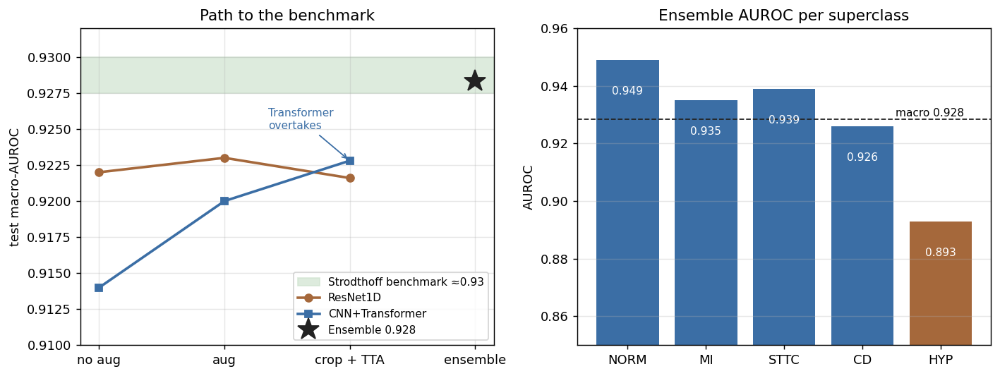
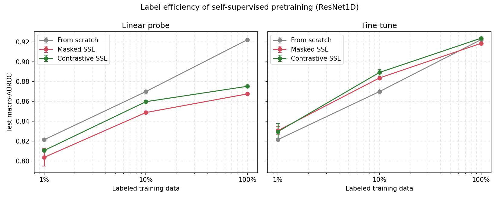

# deep-ecg

Multi-label diagnostic classification of 12-lead ECGs on **PTB-XL** (5 diagnostic
superclasses). A residual 1D CNN and a CNN+Transformer are trained, regularized
with signal augmentation, and ensembled to the level of the PTB-XL benchmark. Two
self-supervised objectives — masked signal reconstruction and a contrastive
(CLOCS-style) objective — then pretrain the encoder on the unlabeled signals,
improving label efficiency in the low-data regime.

## Results

macro-AUROC on the official test fold (fold 10), best checkpoint by validation
macro-AUROC.

| Model | macro-AUROC | NORM | MI | STTC | CD | HYP |
|-------|:-----------:|:----:|:--:|:----:|:--:|:---:|
| ResNet1D (6.3M) | 0.923 | 0.946 | 0.930 | 0.931 | 0.917 | 0.892 |
| CNN+Transformer (2.9M, crop + TTA) | 0.923 | 0.941 | 0.925 | 0.932 | 0.918 | 0.885 |
| **Ensemble** | **0.928** | 0.949 | 0.935 | 0.939 | 0.926 | 0.893 |

Strodthoff et al. report a best macro-AUROC of ≈0.93 on this task; the ensemble
matches it (0.928, bootstrap 95% CI 0.921–0.936).

## What the experiments show

- Without augmentation both models overfit within ~10 epochs. Augmentation
  delays this and helps the CNN+Transformer most — under strong augmentation with
  random cropping it overtakes the ResNet, consistent with the more data-hungry
  model gaining more from a data multiplier.
- Random-crop training requires matching test-time crop averaging (TTA);
  evaluating a cropped model on the full-length signal underperforms.
- Ensembling the two architectures closes the remaining gap to the benchmark.
- HYP is the hardest superclass (lowest prevalence at 12%, amplitude-based).

## Label efficiency with self-supervised pretraining

The encoder is pretrained on the unlabeled training signals with two
self-supervised objectives — masked reconstruction (random 0.5 s spans masked
across all leads and reconstructed under MSE) and a contrastive CLOCS-style
objective (two augmented crops of a record as a positive pair, NT-Xent loss) —
then assessed under three regimes at 1%, 10% and 100% of the labels: training
from scratch, a linear probe on the frozen encoder, and fine-tuning.

Test macro-AUROC; the 1% and 10% regimes report the mean over three subsampling
seeds.

| Regime | Pretext | 1% | 10% | 100% |
|--------|---------|:--:|:---:|:----:|
| From scratch | — | 0.822 | 0.870 | 0.922 |
| Linear probe | Masked | 0.804 | 0.849 | 0.868 |
| Linear probe | Contrastive | 0.811 | 0.860 | 0.875 |
| Fine-tune | Masked | 0.831 | 0.884 | 0.919 |
| Fine-tune | Contrastive | 0.830 | 0.889 | **0.924** |

- Fine-tuning a self-supervised encoder improves label efficiency in the
  low-label regime: at 10% labels both pretext tasks beat from-scratch by
  ~1.5–2 points, and at 1% by ~1 point.
- The contrastive objective is the stronger pretext: its frozen features are more
  linearly separable than the reconstruction ones (linear probe higher at every
  fraction), and fine-tuning matches or exceeds masked reconstruction.
- Contrastive fine-tuning is the only setting that also improves on from-scratch
  at full labels (0.924 vs 0.922); masked reconstruction gives no gain there, as
  ~17k labels already saturate the encoder.
- A frozen encoder (linear probe) still trails end-to-end training for both
  pretexts — the diagnostic task needs the encoder to adapt.

## Task and data

PTB-XL (PhysioNet): ~21.8k 10-second 12-lead ECGs at 100 Hz. SCP codes are mapped
to the five diagnostic superclasses (NORM, MI, STTC, CD, HYP); the official
stratified folds are used (train 1–8, validation 9, test 10). Exploratory
analysis is in [`notebooks/eda.ipynb`](notebooks/eda.ipynb). PTB-XL is released
under CC-BY 4.0 and is not redistributed here.

## Design

The encoder is kept separate from the task head and the data layer is built
around an `ECGSource` adapter, so the encoder and pipeline extend to
self-supervised pretraining and additional ECG databases without rewrites.
Experiments are config-driven (Hydra), tracked in Weights & Biases and seeded.

## References

- Wagner et al. *PTB-XL, a large publicly available electrocardiography dataset.*
  Scientific Data, 2020.
- Strodthoff et al. *Deep learning for ECG analysis: benchmarks and insights from
  PTB-XL.* IEEE JBHI, 2021.
